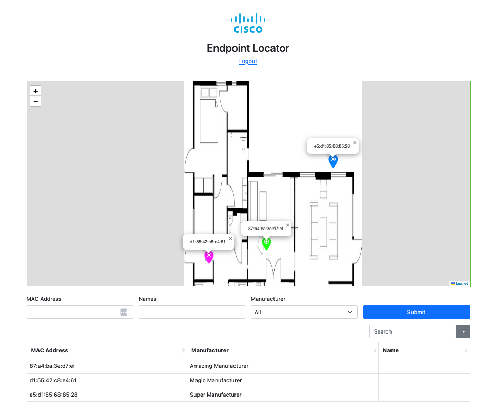

# GVE DevNet CMX Custom Map
Custom Map dashboard for CMX devices information. This takes in either pre-collected JSON data or
connect directly to a CMX instance for live data updates.


## High Level Design


## Contacts
* Josh Ingeniero (jingenie@cisco.com)

## Solution Components
* CMX
*  Python
*  Javascript

## Installation:

#### Clone the repo
```console
git clone https://github.com/gve-sw/gve_devnet_cmx_custom_map
```
#### Set up a Python venv
First make sure that you have Python 3 installed on your machine. We will then be using venv to create
an isolated environment with only the necessary packages.

##### Install virtualenv via pip
```
$ pip install virtualenv
```

##### Create a new venv
```
Change to your project folder
$ cd gve_devnet_cmx_custom_map

Create the venv
$ virtualenv venv

Activate your venv
$ source venv/bin/activate
```

#### Install dependencies
```
$ pip install -r requirements.txt
```

## Setup

#### CMX details:
You can deploy this prototype in a lab environment or your own CMX deployment.
You must have your CMX set up for HTTP Requests to get location information.
Fill in the details of your CMX deployment in the [DETAILS.py](web-app/DETAILS.py) file in the web-app folder.
You may also opt to generate dummy data in CMX format found in the [file.json](file.json) file.
```python
# CMX Details
CMX_USERNAME = "admin"
CMX_PASSWORD = "password"
CMX_URL = "192.168.10.10"

# Options
DATESTRING = '%d-%m-%Y %H:%M'
LOCAL_JSON = True # Use if you are using dummy data

```


## Usage:
These require the appropriate venv to be activated.

### Web App
Run the flask app to access the dashboard
```
$ cd web-app
$ flask run
```

Navigate to http://localhost:5000 and login using the pre-defined account.
```
Username: Cisco
Password: sF19x*YPnOZ%
```
More users can be defined under [users.json](users.json) with password in sha256_crypt format.

```json
[
    {
    "username": "chen",
    "password": "$5$rounds=535000$TkqtekpQGQ8UddO/$PbG9GgmO0FKkuscSgIqqxE23qLbTrDvkBH5t6Ca9cP7"
  }
]
```

### Sample Data
You may opt to use sample data in CMX format found in the [file.json](file.json).
```json
{
        "macAddress":  "d1:55:42:c8:e4:61",
        "mapInfo":  {
                        "mapHierarchyString":  "MAP\u003eINFO\u003eMAP",
                        "floorRefId":  "floorRefId",
                        "floorDimension":  "floorDimension",
                        "image":  "image"
                    },
        "mapCoordinate":  {
                              "x":  35.71979,
                              "y":  161.8946,
                              "z":  0.0,
                              "unit":  "FEET"
                          },
        "currentlyTracked":  true,
        "confidenceFactor":  432.0,
        "locComputeType":  "RSSI",
        "statistics":  {
                           "currentServerTime":  "2022-09-23T11:40:32.008+0800",
                           "firstLocatedTime":  "2022-07-17T09:30:08.911+0800",
                           "lastLocatedTime":  "2022-09-23T11:40:23.346+0800",
                           "maxDetectedRssi":  "maxDetectedRssi"
                       },
        "historyLogReason":  "DISTANCE_CHANGE",
        "geoCoordinate":  null,
        "rawLocation":  {
                            "rawX":  -999.0,
                            "rawY":  -999.0,
                            "unit":  "FEET"
                        },
        "networkStatus":  "ACTIVE",
        "changedOn":  1663904423346,
        "ipAddress":  [
                          "192.168.241.195",
                          "ipv6"
                      ],
        "userName":  "",
        "ssId":  "ssId",
        "sourceTimestamp":  null,
        "band":  "IEEE_802_11_B",
        "apMacAddress":  "d1:55:42:c8:e4:61",
        "dot11Status":  "ASSOCIATED",
        "manufacturer":  "Magic Manufacturer",
        "areaGlobalIdList":  [
                             ],
        "detectingControllers":  "192.168.200.52",
        "bytesSent":  454109873,
        "bytesReceived":  140997681,
        "guestUser":  false
    }
```

### Name Definitions
By default, the app will use the _userName_ field in the CMX data payload as the name. However, you may opt for
user-defined name definitions found in [names.json](names.json).
```json
{
   "91JD93JD01PA": {
      "Device Number": "Testing Name 1"
   },
   "FAJ20FGM120F": {
      "Device Number": "Testing Name 2"
   }
}
```


### Map Customisation
The app uses [Leaflet.js](https://leafletjs.com/) for rendering the map.
You may change some of the settings in the script file in [index.html](/web-app/app/templates/index.html).
```js
var map = L.map('map', {
            crs: L.CRS.Simple,
            minZoom: -1
        });

var bounds = [[0,0], [433,260]]; // Edit depending on your map's size height/width
var image = L.imageOverlay('/static/img/map.png', bounds).addTo(map); // Point to the appropriate map file

map.fitBounds(bounds);



var {{ manu | regex_replace }} = L.IconMaterial.icon({
    markerColor: 'rgba({{ rgb.r }},{{ rgb.g }},{{ rgb.b }},1)'  // Marker fill color
  })



var markers = [];

    
markers.push({pos: [{{ entry.mapCoordinate.y }}, {{ entry.mapCoordinate.x }}],
    popup: "{{ entry.userName.split('/')[1].split('.')[0] }}{{ entry.name }}{{ entry.macAddress }}",
    icon: {{ entry.manufacturer | regex_replace if entry.manufacturer is not none else "None" }}})
    

markers.forEach(function (obj) {
    var m = L.marker(obj.pos, {icon: obj.icon}).addTo(map),
        p = new L.Popup({ autoClose: false, closeOnClick: false })
                .setContent(obj.popup)
                .setLatLng(obj.pos);
    m.bindPopup(p).openPopup(); // Comment if you want no pop-ups opened by default
});
map.setView( [70, 120], 1);
```

### Troubleshooting
Please refer to the generated search.log, rbac.log, and app.log


# Screenshots

### CMX Custom Map



### LICENSE

Provided under Cisco Sample Code License, for details see [LICENSE](LICENSE.md)

### CODE_OF_CONDUCT

Our code of conduct is available [here](CODE_OF_CONDUCT.md)

### CONTRIBUTING

See our contributing guidelines [here](CONTRIBUTING.md)

#### DISCLAIMER:
<b>Please note:</b> This script is meant for demo purposes only. All tools/ scripts in this repo are released for use "AS IS" without any warranties of any kind, including, but not limited to their installation, use, or performance. Any use of these scripts and tools is at your own risk. There is no guarantee that they have been through thorough testing in a comparable environment and we are not responsible for any damage or data loss incurred with their use.
You are responsible for reviewing and testing any scripts you run thoroughly before use in any non-testing environment.